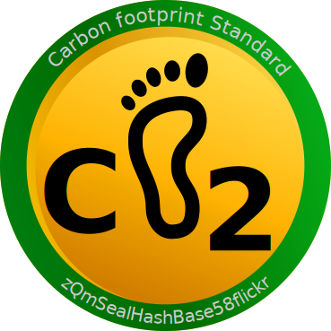

---
title: tons, Carbon Footprint Standard
--- 


## Carbon Footprint Standard (courtesy @cryptolake2)

[][fptk]
<style>
img[alt=tons] { max-width: 20vw; float: right }
</style>

Carbon credit suffers from the “double credit” problem, similar to double spending on blockchains.

This occurs when someone sequesters carbon and “resells” the credit
several times. It is difficult to prove where the carbon goes since it
is not “shipped” like products.

To avoid this, we can [tokenize][fptk] every capture, and keep a book on all
carbon captures on a globally recognized ledger.

A fixed, universally approved format for carbon capture reporting can
be used, where each record can be audited. If the format is fixed there
can’t be 2 different ways to identify a record. A hash (SHA256) of
a [canonical file][cf] is used for location and identification. No credit is
released if the [hash] is already spent !!!


The token can be "[colored][tcol]" with the footprint hash giving access to the full record of the capture along the journey
of the carbon credit !

An example can be seen at the address [cfpsVJTbr5hhnmjmRV9HDm8jWw4kxumgQu74S9USX78][fptk] on Solana.
It is attached to the record [QmYqP9AWHmP9x9bK4amsooSnntaiJwDQbAiNLNbL8HoRXm][tcol])

Obviously we would need a "lint" service to validate the json file for compliance.


```json
{
   "Latitude" : "46.5174384",
   "Longitude" : "6.562264",
   "co2eq" : "2454.0",
   "date" : "Sun Jun  5 02:07:36 PM CEST 2022",
   "debtUSD" : "-184",
   "energykWh" : "12303487.0",
   "ewastekg" : "0.130",
   "freshwaterL" : "2000",
   "location" : "https://goo.gl/maps/E1fuqUNNSmstQTyx8",
   "origin" : "sig1origin",
   "pluscode" : "GH87+X4",
   "priceUSD/kg" : "0.007",
   "seal" : "QmQh6yg8yhs6LyRHbJWaJLsAqpVukuXgsD7UhPPJ7dCyVM",
   "valid-until" : "2022/6/21",
   "witness" : "sig2witness"
}
```

[hash]: https://ipfs.safewatch.xyz/ipfs/zb2rhfP8JWxK8vicqf1mvo3gzgHdWBA6MZJBmZF7WdBQuJfu9
[tcol]: https://ipfs.safewatch.xyz/ipns/QmYqP9AWHmP9x9bK4amsooSnntaiJwDQbAiNLNbL8HoRXm
[cf]: https://ipfs.safewatch.xyz/ipfs/zb2rhfP8JWxK8vicqf1mvo3gzgHdWBA6MZJBmZF7WdBQuJfu9
[fptk]: https://explorer.solana.com/address/cfpsVJTbr5hhnmjmRV9HDm8jWw4kxumgQu74S9USX78?cluster=devnet 


```yaml
intention: Agree on what is a footprint for better accountancy
name: Carbon Footprint Standard
symbol: tons
description: "We want to define a standard for reporting emission so we double credits can be avoided"
```

you may contact us
at our telegram group: [@cryptolake2](https://t.me/cryptolake2)

