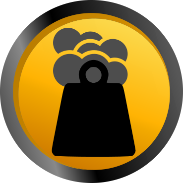

--- # Carbon Footprint


<style>
img[alt=$symbol] { max-width: 20vw; float: right }
</style>

Our current governance is flawed, our living condition have worsen,
and the life is endanger due to so many irresponsible behavior
We are commited to make a change in this world.

We believe we have to roll up our sleves as it would not come form our gouverments
they have demonstrated over the paste years they are unable to serve our (general) interrest.

What to do ?
There is power in joining forces, we have readily available social tools,
communication technologies, immense knowledege sharing capability,
if carefully orchestrated we can address and solve any problem we want
(yes any...)

We can stop wars, transition to a no fossil economy, reestablish healthy commerce and support
between nations etc.

What does it takes ? simply rallying behind a same goal, gathering critical mass to act.
when we are acting in synergy to solve a given probleme we have consensue...
we are innovative we are the solution and nothing can stop us from delivering it.


We are the people, we can set the rules how we want our world to be.

I pick a better one! who's with me ?


if you'd like to experiment with a new style of autonomous governance
to solve our current world crisis.

The first goal I want to achieve is a decarbonization of our atmophere
as it is a real thread to the whole eco-system and life in it.
We triggered the 6th great extinction of life on earth
and spicies are disappearing by the minutes at the present time.

For every goal we define a key parameter to measure and monitor our progress
so let's choose a CO2eq metrics and account for every green-house-gases footprint
in ALL aspect of our life and economy. Let's start putting a "verified" price tag
on all products, services and valuables we exchanges along out daily activities.

please consider getting the "Carbon Footprint" token below :

\`\`\`yaml
name: Carbon Footprint
symbol: kgCO2eq
intention: better governance to make significant changes
\`\`\`

if you encounted any items that is not "carbon priced" please report it
and if possible refuse it until it has one.


For more information on how we track carbon : see our "[carbon merkle tree][1]" technique

[1]: https://duckduckgo.com/?q=carbon+merkle+tree+!g

you may contact us
at our telegram group: [@cryptolake2](https://t.me/cryptolake2)


```
```

